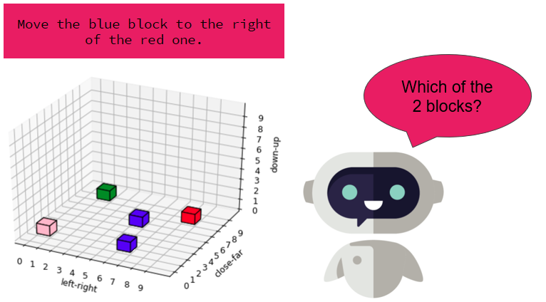

  

# Introduction
The field of artificial intelligence is moving toward creating agents capable of interacting with humans in both
digital and real-world applications. This ability to interact is initially limited by the agent’s ability to understand the
user through their use of natural language. A block world environment is a collection of blocks, each with their
own characteristics, such as a color, and each with their own unique location. An agent has been established
capable of rearranging a digital block world from an initial state into a state described by natural language. The
agent uses features of natural language processing including part of speech tagging to ground commands and
accomplish this task. It has been optimized to interpret the referencing of blocks by their attributes and
commands issued by the relative positions of blocks comprising the world. The agent successfully handles
ambiguities with visual feedback to the user and executes the desired commands using A*-search in an effort to
path-plan the desired moves in as few steps as possible.

